# ViQure Healthtech — Video Consultation: Architecture & Completion Blueprint

**Component:** Live video consultation (telemedicine)
**Current stack:** MERN — MongoDB (Mongoose 9) · Express 5 · React + Ant Design + Tailwind (Vite) · JWT auth · Razorpay
**Target media backend:** LiveKit (self-hostable, open-source WebRTC SFU)
**Compliance target:** India — DPDP Act 2023 + Telemedicine Practice Guidelines (2020)
**Document type:** Full architecture blueprint + phased roadmap
**Prepared:** 07 August 2026

> This is an engineering design document, not legal advice. The compliance sections translate the DPDP Act and the Telemedicine Practice Guidelines into concrete technical controls; a qualified privacy/medico-legal reviewer should sign off before go-live.

---

## Table of contents

1. [Executive summary](#1-executive-summary)
2. [Current state (as-is)](#2-current-state-as-is)
3. [Gap analysis](#3-gap-analysis)
4. [Decision: why LiveKit](#4-decision-why-livekit)
5. [Target architecture overview](#5-target-architecture-overview)
6. [Access control & token model](#6-access-control--token-model)
7. [Meeting lifecycle & state machine](#7-meeting-lifecycle--state-machine)
8. [Waiting room / lobby](#8-waiting-room--lobby)
9. [Data model changes](#9-data-model-changes)
10. [API surface & webhooks](#10-api-surface--webhooks)
11. [Recording & storage](#11-recording--storage)
12. [Real-time signaling, presence & notifications](#12-real-time-signaling-presence--notifications)
13. [Network resilience, TURN & error handling](#13-network-resilience-turn--error-handling)
14. [Frontend architecture](#14-frontend-architecture)
15. [Security & compliance (DPDP + Telemedicine Guidelines)](#15-security--compliance-dpdp--telemedicine-guidelines)
16. [Observability & audit](#16-observability--audit)
17. [Testing strategy](#17-testing-strategy)
18. [Deployment topology & cost](#18-deployment-topology--cost)
19. [Phased roadmap & effort estimates](#19-phased-roadmap--effort-estimates)
20. [Risks & open decisions](#20-risks--open-decisions)
21. [Appendix: schema diffs, endpoints, env](#21-appendix-schema-diffs-endpoints-env)

---

## 1. Executive summary

The video consultation feature is wired end-to-end for a demo but is built on the **public `meet.jit.si` server with no access control, no lifecycle management, and no clinical/compliance controls**. Any party who learns a room name can join; the room name is derived from the appointment `_id` plus only 4 random bytes (32 bits of entropy), and the full link is stored in the database and shipped to the client. There is no server-side notion of a call starting, ending, who attended, for how long, or whether anything was recorded — the backend's `MeetingSchema` carries only `meetingId`, `meetingLink`, and `consultationType`.

This blueprint replaces the public-Jitsi embed with a **self-hosted LiveKit SFU** that ViQure owns and operates, and layers on the controls a production telemedicine call needs: **short-lived JWT room tokens with per-role grants**, an explicit **call lifecycle** driven by LiveKit webhooks, an **application-layer waiting room**, **consent-gated server-side recording** to India-region object storage, **presence-driven notifications** (reusing the already-present but unused `fcmToken`), **reconnection/TURN fallback**, and a **call-event audit trail** that satisfies the record-keeping expectations of the Telemedicine Practice Guidelines and the DPDP Act.

The work is scoped into four phases (Section 19). Phase 1 (the security-critical core — owned media backend + tokenized access + lifecycle) is the minimum that makes the feature safe to run with real patients; later phases add recording, resilience hardening, and multi-node scale.

---

## 2. Current state (as-is)

### 2.1 What exists and how it is wired

The flow today spans four points in the codebase:

| Layer | File | Responsibility today |
|---|---|---|
| Room creation | `server/controllers/appointment.controller.js` → `confirmAppointment` | On doctor confirm, mints a Jitsi room name and a `meet.jit.si` URL |
| Persistence | `server/models/appointments.model.js` → `MeetingSchema` | Stores `meetingId`, `meetingLink`, `consultationType` |
| Patient/doctor entry | `client/src/pages/Appointments.jsx` | `canJoin()` gate + "Join" button → routes to `/consultation/:id` |
| Doctor entry (dashboard) | `client/src/pages/DoctorDashboard.jsx` | "Join" opens `meeting.meetingLink` in a new tab |
| In-app call | `client/src/pages/Consultation.jsx` | Loads the Jitsi IFrame API and embeds the room |

Room generation (server), on confirm:

```js
// appointment.controller.js — confirmAppointment (excerpt)
if (appointment.meeting?.consultationType === 'VIDEO' && !appointment.meeting.meetingId) {
  const roomName = `ViQure-${appointment._id}-${crypto.randomBytes(4).toString('hex')}`;
  appointment.meeting.meetingId = roomName;
  appointment.meeting.meetingLink = `https://meet.jit.si/${roomName}`;
}
```

Client join gate (`Consultation.jsx`) enforces, on the browser only: appointment is `CONFIRMED`, a `meetingId` exists, `consultationType === 'VIDEO'`, and the current time is inside a join window (`EARLY_MINUTES = 15`, `LATE_MINUTES = 120`). It then injects `https://meet.jit.si/external_api.js` and mounts `new JitsiMeetExternalAPI(...)` with `prejoinPageEnabled: true`.

Supporting facts about the surrounding system, confirmed from the code:

- **Auth** is JWT bearer; `protect` (`auth.middleware.js`) verifies the token and loads the full `User` document onto `req.user`; `restrictTo(...roles)` guards by role. Roles are `CUSTOMER`, `DOCTOR`, `ADMIN`.
- **Appointment status** enum: `BOOKED → CONFIRMED → COMPLETED`, plus `CANCELLED`/`REJECTED`. The room is generated at `CONFIRMED`.
- `User` already carries an unused **`fcmToken`** field — push-notification plumbing is half-present.
- There is **no** Socket.IO / WebSocket layer, **no** email/SMS provider, and **no** notification model in the backend today.
- `documentsShared[]` exists on the appointment but is not surfaced inside the call.
- Payments run through Razorpay, but `confirmAppointment` does **not** verify payment before generating the room (the code comment says "typically after payment captured", but nothing enforces it).

### 2.2 As-is diagram

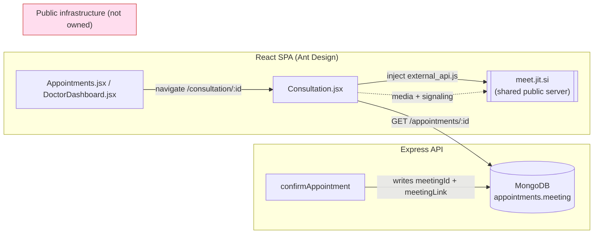

The red block is the core problem: the media path and the room's access boundary live on infrastructure ViQure does not control and cannot secure.

---

## 3. Gap analysis

Mapping the current implementation against what a production telemedicine call requires:

| # | Capability | Today | Required | Severity |
|---|---|---|---|---|
| G1 | **Owned media backend** | Public `meet.jit.si` | Self-operated SFU on ViQure infra | 🔴 Critical |
| G2 | **Access control** | Unguessable-ish URL only (32 bits + `_id`) | Short-lived signed tokens, per-identity, per-role grants | 🔴 Critical |
| G3 | **Server-authoritative join window** | Enforced in browser only (bypassable) | Enforced at token issuance on the server | 🔴 Critical |
| G4 | **Payment gate before room access** | Not enforced | Token issued only for paid + confirmed appts | 🟠 High |
| G5 | **Call lifecycle** | None (no start/end/attendance) | Explicit session state machine + webhooks | 🔴 Critical |
| G6 | **Waiting room / lobby** | Jitsi prejoin screen only | App-controlled admission, patient waits for doctor | 🟠 High |
| G7 | **Recording** | None | Consent-gated, encrypted, India-region storage | 🟠 High |
| G8 | **Call history / audit** | None | Per-session event log (join/leave/duration/recording) | 🔴 Critical |
| G9 | **Notifications** | None (fcmToken unused) | "Doctor is ready", reminders, missed-call handling | 🟡 Medium |
| G10 | **Reconnection & TURN fallback** | Whatever Jitsi provides | Owned TURN, reconnect UX, TCP/443 fallback | 🟠 High |
| G11 | **Pre-call device check** | None | Mic/cam/network test before entering room | 🟡 Medium |
| G12 | **In-call document/prescription** | `documentsShared[]` not surfaced | Share panel + post-call prescription per guidelines | 🟡 Medium |
| G13 | **Error handling / fallback** | Minimal | Graceful degradation, PHONE fallback path | 🟠 High |
| G14 | **Consent capture** | None | Explicit teleconsent + recording consent, logged | 🔴 Critical (compliance) |
| G15 | **Test coverage** | Zero (`npm test` is a stub) | Unit + integration + e2e + load for the flow | 🟠 High |
| G16 | **Dead fallback link** | `meet.viqure.com/${_id}` in `DoctorDashboard.jsx` | Remove; single tokenized join path | 🟡 Medium |

---

## 4. Decision: why LiveKit

A compressed ADR for the pivotal choice.

**Context.** ViQure needs to own its real-time media backend (per the PRD's intent and the compliance requirement to control where PHI-bearing media flows), on a MERN team, targeting India, without a multi-week from-scratch build.

**Options considered.**

| Option | Ownership | Effort to production | Built-in recording/tokens | Ops burden | Verdict |
|---|---|---|---|---|---|
| Public Jitsi (today) | None | — | Weak | Low | ❌ Not securable |
| Self-hosted Jitsi + JWT / 8x8 JaaS | Medium | Low–Med | Yes (JWT, Jibri) | Med | Viable, but Jibri recording is heavy and the JS API is less ergonomic |
| **LiveKit (self-hosted OSS SFU)** | **High** | **Medium** | **Yes (JWT grants, Egress)** | **Med** | ✅ **Chosen** |
| Managed CPaaS (100ms/Agora/Twilio) | Low (media outsourced) | Lowest | Yes | Lowest | Fast, but per-minute cost + media leaves ViQure's control |
| Custom WebRTC + mediasoup | Highest | Very high (weeks) | Build it all | High | Over-scoped for the timeline |

**Decision — LiveKit, self-hosted.** LiveKit is an open-source WebRTC **SFU** (Selective Forwarding Unit) with:

- **JWT access tokens** carrying fine-grained `video` grants (which room, publish vs subscribe, admin) — exactly the access-control primitive G2 needs.
- A first-class **Node server SDK** (`livekit-server-sdk`) that drops into Express, and a **React SDK** (`@livekit/components-react`) that replaces the Jitsi embed.
- **Egress** for server-side recording to S3-compatible storage (G7), decoupled from the media path.
- **Webhooks** for the lifecycle events (G5, G8).
- Embedded **TURN/TURNS** for NAT traversal (G10).
- The option to run **self-hosted** (full ownership, India region) now and lift-and-shift to LiveKit Cloud later without changing application code, because the SDK/token model is identical.

**Consequences.** ViQure takes on operating the SFU (a stateful, UDP-heavy service) and an Egress worker (Chrome + ffmpeg, CPU-heavy). Those are real ops costs, addressed in Sections 13 and 18. The application/business logic, however, stays thin: the backend only mints tokens, reacts to webhooks, and orchestrates recording — it never touches media.

---

## 5. Target architecture overview

The design keeps the existing Express monolith as the **control plane** (auth, appointments, token issuance, lifecycle orchestration) and introduces LiveKit as a separate **media plane**. The React app talks to both: HTTPS/REST to Express, and WebSocket/WebRTC to LiveKit.

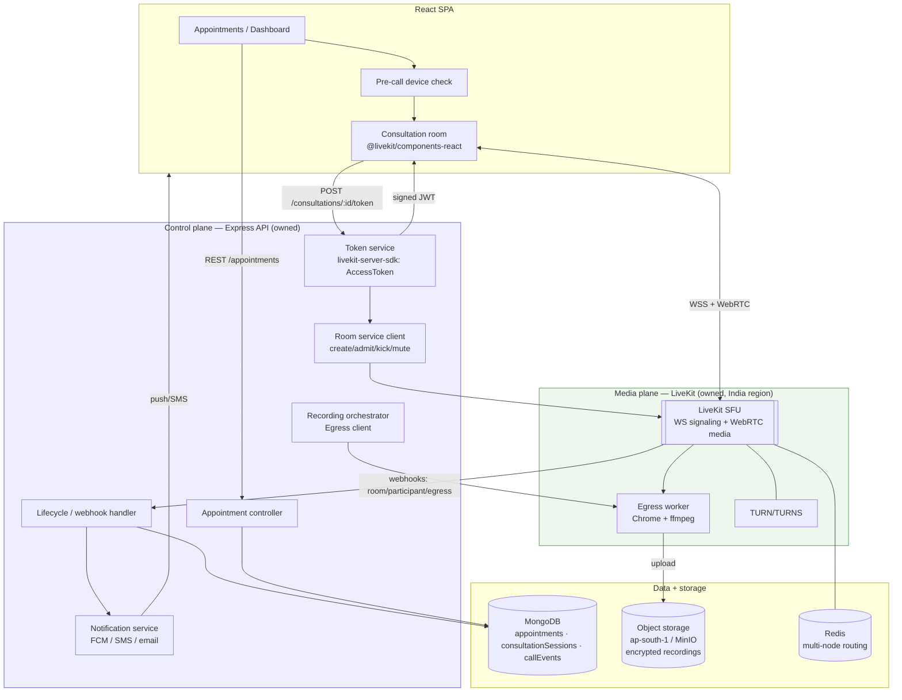

**Key architectural rules.**

1. **The media plane never trusts the client.** Every join is authorized by a server-minted, short-TTL token; the client cannot self-issue or extend access.
2. **The control plane never handles media.** Express only issues tokens and reacts to webhooks — it stays stateless and horizontally scalable.
3. **The database is the source of truth for lifecycle**, reconciled from LiveKit webhooks; LiveKit holds only ephemeral in-call state.
4. **Recording is a side-effect**, orchestrated by the control plane and executed by Egress; the app is resilient if Egress fails (call continues).

---

## 6. Access control & token model

This is the heart of the redesign — it closes G2, G3, and G4.

### 6.1 Principles

- **No standing access.** There is no durable "meeting link" that grants entry. Access is a **short-lived JWT** (TTL ≈ the join window, e.g. 20–30 min) minted per user, per session, at the moment they ask to join.
- **Server is the policy engine.** The token endpoint re-checks, server-side, every condition the browser currently checks (status, window) plus the ones it cannot (identity, payment, role).
- **Least privilege grants.** Patients get publish+subscribe within exactly one room; doctors additionally get `roomAdmin` (to admit from the lobby, mute, and end the call); nobody gets cross-room access.
- **Rooms are opaque.** Room name = `consult_<sessionId>` where `sessionId` is a fresh random identifier, decoupled from the appointment `_id`, and never guessable. The name alone grants nothing without a token.

### 6.2 Token issuance flow

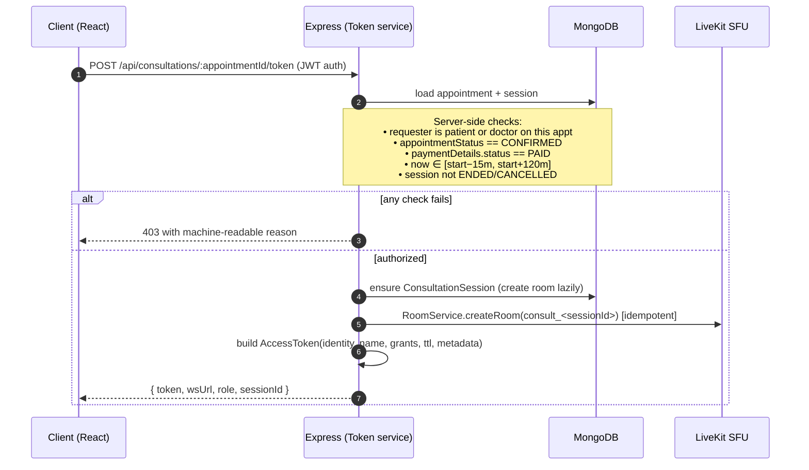

### 6.3 Grants per role

| Claim | Patient | Doctor | Admin (observer) |
|---|---|---|---|
| `room` | `consult_<sessionId>` | same | same |
| `roomJoin` | ✅ | ✅ | ✅ |
| `canPublish` (audio/video) | ✅ | ✅ | ❌ (silent observer, dispute review only) |
| `canSubscribe` | ✅ | ✅ | ✅ |
| `canPublishData` (chat/signals) | ✅ | ✅ | ❌ |
| `roomAdmin` (admit/mute/kick/end) | ❌ | ✅ | ❌ |
| `identity` | `patient_<userId>` | `doctor_<userId>` | `admin_<userId>` |
| `metadata` | `{role, appointmentId, admitted:false}` | `{role, appointmentId}` | `{role, readonly:true}` |
| Token TTL | join window remaining, capped 30m | same | 30m |

Identities are **prefixed and tied to the authenticated user**, so webhook events map unambiguously back to a `User` and the audit log cannot be spoofed.

### 6.4 Reference: token endpoint (Node, `livekit-server-sdk`)

```js
// server/controllers/consultation.controller.js  (new)
const { AccessToken } = require('livekit-server-sdk');

const issueToken = catchAsync(async (req, res) => {
  const appt = await Appointment.findById(req.params.appointmentId);
  if (!appt) throw new ApiError(404, 'Appointment not found');

  const isPatient = appt.patientId.equals(req.user._id);
  const isDoctor  = appt.doctorId.equals(req.user._id);
  if (!isPatient && !isDoctor) throw new ApiError(403, 'Not a participant');
  if (appt.appointmentStatus !== 'CONFIRMED') throw new ApiError(409, 'APPT_NOT_CONFIRMED');
  if (appt.paymentDetails.status !== 'PAID')   throw new ApiError(402, 'PAYMENT_REQUIRED');

  const { ok, reason, ttlSec } = joinWindow(appt.schedule.startDateTime); // server-side clock
  if (!ok) throw new ApiError(403, reason);

  const session = await ensureSession(appt); // creates ConsultationSession + LiveKit room, idempotent

  const at = new AccessToken(process.env.LIVEKIT_API_KEY, process.env.LIVEKIT_API_SECRET, {
    identity: `${isDoctor ? 'doctor' : 'patient'}_${req.user._id}`,
    name: `${req.user.profile?.firstName ?? ''} ${req.user.profile?.lastName ?? ''}`.trim(),
    ttl: ttlSec,
    metadata: JSON.stringify({ role: isDoctor ? 'DOCTOR' : 'PATIENT', appointmentId: String(appt._id) }),
  });
  at.addGrant({
    room: session.roomName,
    roomJoin: true,
    canPublish: true,
    canSubscribe: true,
    canPublishData: true,
    roomAdmin: isDoctor,       // doctor is host
  });

  res.json({ success: true, data: { token: await at.toJwt(), wsUrl: process.env.LIVEKIT_WS_URL, sessionId: session._id, role: isDoctor ? 'DOCTOR' : 'PATIENT' } });
});
```

> **Secrets never reach the browser.** `LIVEKIT_API_SECRET` signs tokens only on the server. The client receives just the signed JWT + the public WS URL.

---

## 7. Meeting lifecycle & state machine

Today "the call" has no server-side existence. We introduce a **`ConsultationSession`** whose state is driven by LiveKit webhooks, and we couple it to the existing `appointmentStatus` without breaking that enum.

### 7.1 Session state machine

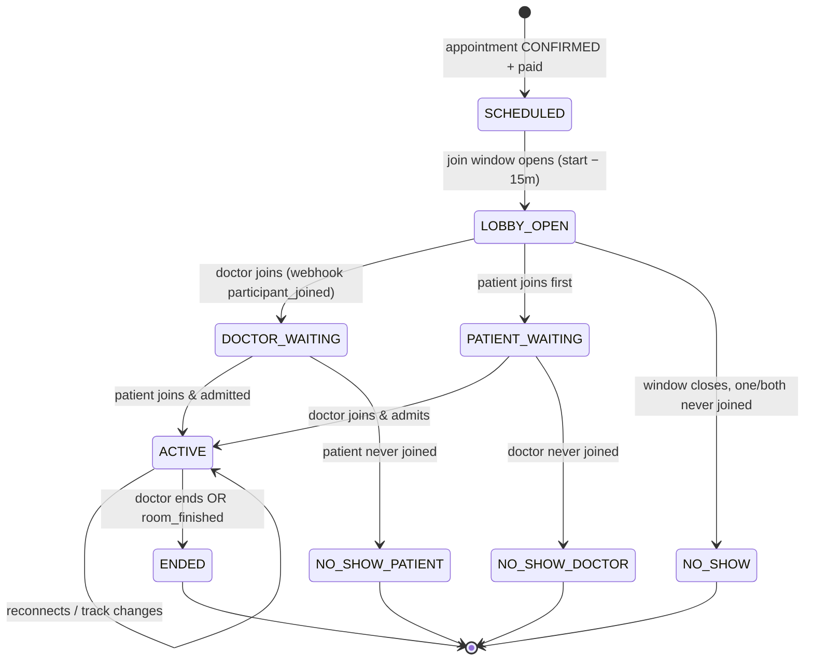

### 7.2 Mapping to `appointmentStatus`

The `appointmentStatus` enum (`BOOKED/CONFIRMED/COMPLETED/CANCELLED/REJECTED`) is **not changed** — session state is a finer-grained sublayer. Transitions:

- `ENDED` with both parties having been `ACTIVE` → controller may auto-advance appointment toward `COMPLETED` (still requiring the doctor's remarks per existing `completeAppointment`).
- `NO_SHOW_DOCTOR` → flag for refund/reschedule workflow (patient protection).
- `NO_SHOW_PATIENT` → doctor is credited per no-show policy; appointment eligible for `COMPLETED`/no-show close.

### 7.3 Webhook → state reconciliation

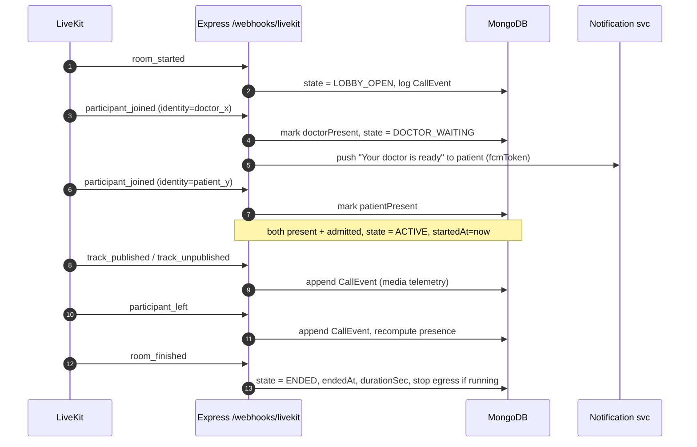

Every webhook is **verified** with LiveKit's `WebhookReceiver` (validates the signature in the `Authorization` header against the API key) before any state change — this is the trust boundary for the media plane.

---

## 8. Waiting room / lobby

LiveKit has no built-in "lobby" like Jitsi; we implement it at the application layer, which is the standard pattern and gives ViQure clinical control over admission (a patient should not be alone in a room, and a doctor should admit deliberately).

**Model.** The patient's token grants `roomJoin` but the client enters a **"waiting" UI state** (metadata `admitted:false`) and does **not** render remote media until admitted. The doctor holds `roomAdmin`. Two viable mechanisms:

1. **Metadata admission (recommended).** On the patient joining, the server (reacting to `participant_joined`) or the doctor's client updates the patient's participant metadata to `admitted:true` via `RoomService.updateParticipant`. The patient client watches its own metadata and transitions from "waiting" to "in-call". Doctor sees a lobby list built from `participant_joined` events / `RoomService.listParticipants`.
2. **Two-room hop.** Patient first joins `lobby_<sessionId>` (subscribe-only), doctor admits by having the server mint a new token for `consult_<sessionId>`. Cleaner isolation, slightly more orchestration.

**Recommended:** Option 1 for Phase 1 (simpler, one room), with the "doctor is ready" push closing the loop so the patient isn't staring at a waiting screen blindly.

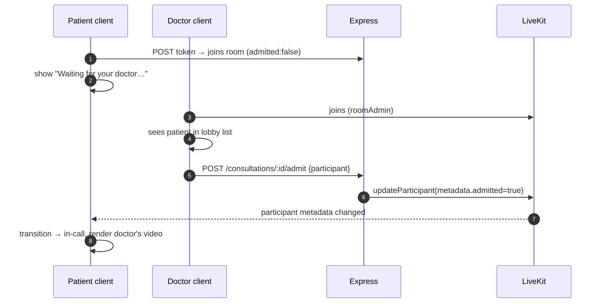

---

## 9. Data model changes

The existing `MeetingSchema` (three fields) is too thin to carry lifecycle, attendance, recording, and consent. We keep it backward-compatible and add two collections plus a consent record.

### 9.1 Entity relationships

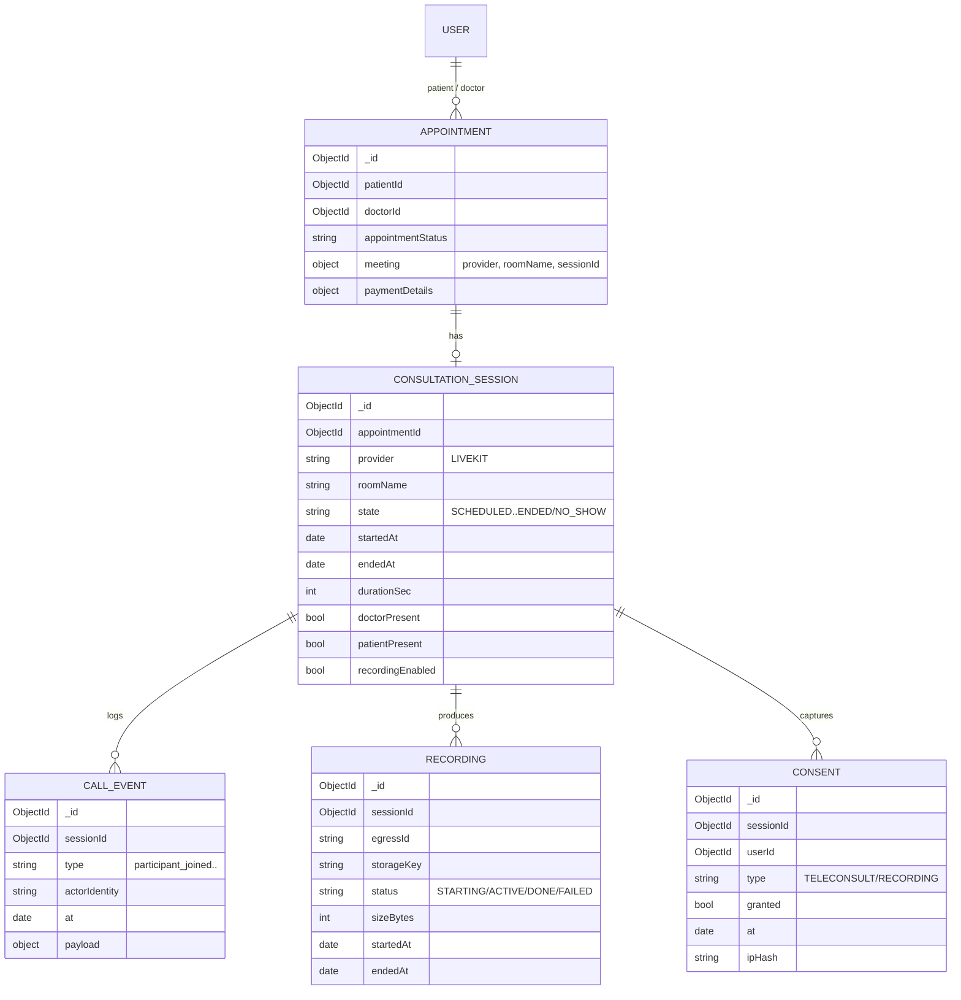

### 9.2 `MeetingSchema` — additive diff

```js
const MeetingSchema = new Schema({
  meetingId:   { type: String, trim: true },   // kept (legacy Jitsi rooms)
  meetingLink: { type: String, trim: true },   // kept (legacy)
  consultationType: { type: String, enum: ['VIDEO','PHONE','IN_PERSON'], default: 'VIDEO' },
  // --- new ---
  provider:  { type: String, enum: ['JITSI','LIVEKIT'], default: 'LIVEKIT' },
  roomName:  { type: String, trim: true },     // opaque: consult_<sessionId>
  sessionId: { type: Schema.Types.ObjectId, ref: 'ConsultationSession' },
}, { _id: false });
```

Keeping `meetingId`/`meetingLink` means **existing appointments keep working** during migration; `provider` discriminates old Jitsi rooms from new LiveKit ones so the client can branch.

### 9.3 New `ConsultationSession` model

```js
const ConsultationSessionSchema = new Schema({
  appointmentId: { type: Schema.Types.ObjectId, ref: 'Appointment', required: true, index: true },
  provider:  { type: String, default: 'LIVEKIT' },
  roomName:  { type: String, required: true, unique: true },
  state: {
    type: String,
    enum: ['SCHEDULED','LOBBY_OPEN','PATIENT_WAITING','DOCTOR_WAITING','ACTIVE',
           'ENDED','NO_SHOW','NO_SHOW_PATIENT','NO_SHOW_DOCTOR','CANCELLED'],
    default: 'SCHEDULED', index: true,
  },
  doctorPresent:  { type: Boolean, default: false },
  patientPresent: { type: Boolean, default: false },
  startedAt: Date,
  endedAt:   Date,
  durationSec: { type: Number, default: 0 },
  recordingEnabled: { type: Boolean, default: false },
  recordingConsent: { type: Boolean, default: false },
}, { timestamps: true });
```

### 9.4 New `CallEvent` model (append-only audit)

An immutable, append-only event stream per session — the backbone of call history (G8) and the audit trail (compliance). Never updated, only inserted; suitable for a capped or TTL-indexed collection if volume grows.

```js
const CallEventSchema = new Schema({
  sessionId: { type: Schema.Types.ObjectId, ref: 'ConsultationSession', required: true, index: true },
  type: { type: String, required: true },     // room_started, participant_joined, ...
  actorIdentity: String,                        // doctor_<id> / patient_<id> / system
  at: { type: Date, default: Date.now, index: true },
  payload: Schema.Types.Mixed,                  // raw webhook fragment (PHI-minimized)
}, { timestamps: false });
```

Add both to `server/models/index.js`. No changes to the `appointmentStatus` enum are required.

---

## 10. API surface & webhooks

### 10.1 New REST endpoints (mounted under the existing `protect` middleware)

| Method | Path | Role | Purpose |
|---|---|---|---|
| `POST` | `/api/consultations/:appointmentId/token` | patient, doctor | Issue a scoped LiveKit join token (Section 6) |
| `POST` | `/api/consultations/:appointmentId/consent` | patient, doctor | Record teleconsult / recording consent before join |
| `GET` | `/api/consultations/:appointmentId/session` | participants, admin | Session state + presence for UI polling/rehydrate |
| `POST` | `/api/consultations/:sessionId/admit` | doctor | Admit a waiting participant from the lobby |
| `POST` | `/api/consultations/:sessionId/recording/start` | doctor | Start Egress (requires recording consent) |
| `POST` | `/api/consultations/:sessionId/recording/stop` | doctor | Stop Egress |
| `POST` | `/api/consultations/:sessionId/end` | doctor | End call: remove participants, stop egress, close room |
| `GET` | `/api/consultations/:sessionId/events` | admin, participants | Call history / audit for a session |
| `POST` | `/api/webhooks/livekit` | **LiveKit only** (signature-verified, no JWT) | Lifecycle events |

Notes: the webhook route is mounted **before** `protect` (it authenticates by LiveKit signature, not a user JWT) and needs the **raw body** for signature verification, so it uses `express.raw({ type: 'application/webhook+json' })` rather than the global `express.json()`.

### 10.2 Webhook events consumed

| LiveKit event | Session effect | Side-effects |
|---|---|---|
| `room_started` | → `LOBBY_OPEN` | log CallEvent |
| `participant_joined` | set presence; `DOCTOR_WAITING` / `PATIENT_WAITING` / `ACTIVE` | push "doctor ready"; log |
| `participant_left` | recompute presence | log; if all gone near window end → `NO_SHOW_*` |
| `track_published` / `track_unpublished` | media telemetry | log (no PHI) |
| `egress_started` | recording ACTIVE | update Recording |
| `egress_updated` / `egress_ended` | recording DONE/FAILED | persist storageKey, size; log |
| `room_finished` | → `ENDED`; compute `durationSec` | stop egress if running; maybe advance appointment |

### 10.3 Idempotency

Webhooks can be redelivered. Each event carries an id; the handler upserts CallEvents keyed on that id and treats state transitions as idempotent (e.g., re-processing `participant_joined` for an already-present identity is a no-op). This prevents double-counting attendance or duration.

---

## 11. Recording & storage

Recording is **off by default** and only starts when **both parties have consented** (Section 15). It is a clinical/compliance feature (dispute resolution, record-keeping), not a growth feature.

### 11.1 Mechanism

LiveKit **Egress** runs as a separate worker (headless Chrome + ffmpeg). **Room Composite Egress** renders the whole call to a single MP4 and uploads it directly to S3-compatible storage. The control plane starts/stops it via the Egress client; the media path is unaffected if Egress fails.

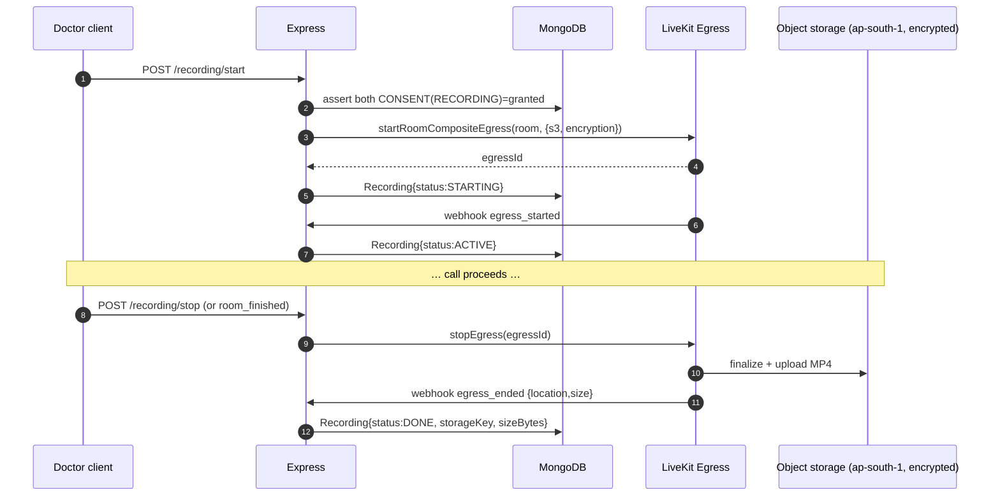

### 11.2 Storage & access rules

- **Region:** object storage in an **India region** (AWS `ap-south-1` Mumbai, or self-hosted **MinIO** in an India datacenter) — see data-residency in Section 15.
- **Encryption at rest:** SSE-KMS (or MinIO SSE); recordings are PHI.
- **No public URLs.** Recordings are served only via **short-lived pre-signed URLs** minted by the control plane after an authorization check (participant or admin, with reason logged).
- **Retention:** configurable retention aligned to medical-record norms, with lifecycle rules to auto-expire; deletion honors DPDP erasure rights where clinically permissible.
- **Lifecycle safety:** if Egress dies mid-call, the call continues; a reconciliation job marks the Recording `FAILED` and alerts ops.

---

## 12. Real-time signaling, presence & notifications

Two distinct real-time needs, solved by two mechanisms:

**In-call signaling** (chat, "doctor is typing", document-shared pings, admit signals) rides LiveKit's **data channels** (`canPublishData`) — no separate WebSocket server is needed inside the room.

**Out-of-call notifications** (the appointment isn't open yet, or the user is on another screen) use a new **Notification service** in Express that finally activates the dormant `fcmToken`:

| Trigger | Channel | Recipient | Message |
|---|---|---|---|
| Doctor joins while patient absent | FCM push + optional SMS | patient | "Your doctor is ready to see you — tap to join" |
| T‑minus 10 min to appointment | FCM push + email | both | reminder with deep link |
| Patient waiting > N min, doctor absent | FCM push + SMS | doctor | "Your patient is waiting" |
| `NO_SHOW_*` | email/SMS | affected party | reschedule / refund info |
| Recording started | in-call banner (data msg) | both | consent-confirmed indicator |

Because there is no notification infrastructure today, this is greenfield: a thin `NotificationService` with pluggable providers (FCM for push, an SMS gateway such as an Indian provider, SMTP/transactional-email for email). Notifications are **fire-and-forget with retry**, never on the call's critical path.

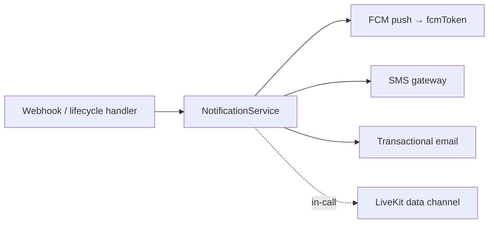

---

## 13. Network resilience, TURN & error handling

Closes G10, G11, G13 — the difference between a demo and a call a sick patient can actually complete on hospital wifi or a 4G phone.

### 13.1 Connectivity

- **STUN/TURN/TURNS.** LiveKit ships embedded TURN; enable **TURN over TLS on 443** so calls survive restrictive corporate/hospital firewalls that block UDP. For scale, run **coturn** alongside.
- **ICE restart & auto-reconnect.** The LiveKit client SDK reconnects automatically on network blips; the UI surfaces a "Reconnecting…" state rather than dropping the user.
- **Adaptive quality.** LiveKit's simulcast + dynacast downgrades resolution on poor links instead of freezing — critical on Indian mobile networks.

### 13.2 Graceful degradation & fallback

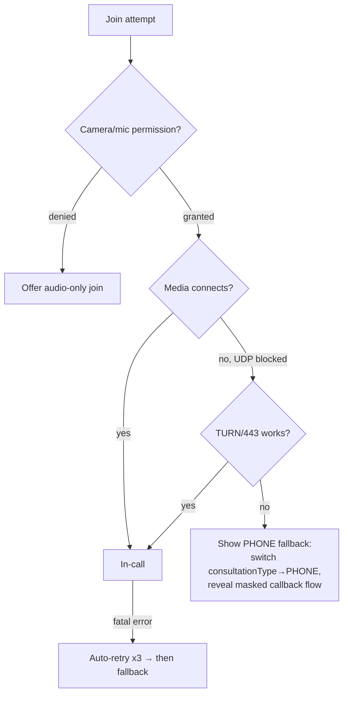

- **Pre-call device check** (new screen): enumerate devices, preview camera, test mic level, run a quick connectivity probe, and show a green/amber/red readiness indicator **before** the patient enters the room — so failures surface in the lobby, not mid-consult.
- **PHONE fallback:** if video cannot establish, offer to convert the session to a phone consult (the schema already supports `consultationType: 'PHONE'`), preserving the appointment and payment.
- **Structured error taxonomy:** every failure maps to a machine-readable code (`PERMISSION_DENIED`, `TOKEN_EXPIRED`, `WINDOW_CLOSED`, `MEDIA_TIMEOUT`, `SFU_UNREACHABLE`) with a user-friendly message and a logged event — replacing today's single generic catch.

---

## 14. Frontend architecture

The Jitsi IFrame embed in `Consultation.jsx` is replaced by LiveKit's React components, and the join path becomes token-driven.

### 14.1 Screen flow

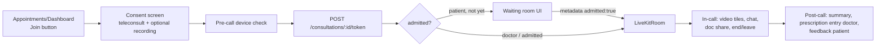

### 14.2 Component structure

- `Consultation.jsx` → thin router/orchestrator that fetches a token then renders `<LiveKitRoom serverUrl={wsUrl} token={token}>`.
- `PreCallCheck.jsx` (new) → device enumeration + connectivity probe.
- `ConsentGate.jsx` (new) → blocks entry until teleconsent (and optional recording consent) is recorded server-side.
- `WaitingRoom.jsx` (new) → patient's pre-admission state, watches own participant metadata.
- `CallStage.jsx` (new) → `@livekit/components-react`: `<GridLayout>`, `<ParticipantTile>`, `<ControlBar>`, plus a custom chat/doc-share panel over the data channel.
- `useConsultationSession.js` (new hook) → wraps token fetch, reconnection state, and session polling for rehydrate on refresh.

### 14.3 What gets removed

- The dynamic `external_api.js` script injection and all `JitsiMeetExternalAPI` usage.
- The dead `https://meet.viqure.com/${apt._id}` fallback in `DoctorDashboard.jsx` (G16) — replaced by the single `/consultation/:id` token path.
- The **client-only** join-window enforcement stays as a UX nicety but is no longer the security boundary (the server owns it now).

### 14.4 Dependencies

- Server: `livekit-server-sdk`.
- Client: `livekit-client`, `@livekit/components-react`, `@livekit/components-styles`.
- These replace the Jitsi CDN script; the bundle now carries the client SDK (tree-shakeable, ~tens of KB gzipped for the core).

---

## 15. Security & compliance (DPDP + Telemedicine Guidelines)

> Engineering controls, not legal sign-off. Map each to a reviewer before go-live.

### 15.1 Telemedicine Practice Guidelines (India, 2020) → controls

The Guidelines govern how a Registered Medical Practitioner (RMP) may consult remotely. The relevant technical obligations and how this design meets them:

| Guideline expectation | Design control |
|---|---|
| **Patient consent** for teleconsultation | `ConsentGate` records a `CONSENT{type:TELECONSULT}` server-side before a token is issued; blocked entry without it |
| **Identification** of both patient and RMP | Tokens carry authenticated, prefixed identities; doctor approval status already gated (`approvalStatus: APPROVED`); display names shown in-call |
| **Explicit consent to record** | Recording starts only when **both** parties have `CONSENT{type:RECORDING}`; an in-call banner signals active recording |
| **Maintenance of records/logs** of the consult | `CallEvent` append-only log + `ConsultationSession` (who, when, duration); `documentsShared[]`; doctor remarks via existing `completeAppointment` |
| **Prescription** issuance | Post-call prescription entry (doctor), stored on the appointment/medical record; out of scope for media but the flow hooks in here |
| **Data privacy & confidentiality** | Owned SFU (no third-party media), encryption in transit (DTLS-SRTP) and at rest, least-privilege access |

### 15.2 DPDP Act 2023 → controls

| DPDP principle | Design control |
|---|---|
| **Consent & purpose limitation** | Granular, logged consent (teleconsult vs recording); media used only for the consultation purpose |
| **Data minimization** | `CallEvent.payload` is PHI-minimized (identities + timing, not content); recordings only when consented |
| **Storage limitation** | Retention policy + object-storage lifecycle expiry on recordings and event logs |
| **Data Principal rights** (access, correction, erasure) | Session/recording records are queryable per user; erasure workflow deletes recordings + minimizes logs where clinically permissible |
| **Security safeguards** | Encryption in transit/at rest, RBAC, signed webhooks, short-TTL tokens, secrets server-side only |
| **Breach notification** | Audit log + alerting give the timeline needed to notify the Data Protection Board and affected principals |
| **Data residency (best practice)** | LiveKit SFU, Egress, and recording storage all pinned to an **India region**; media does not egress the country |

### 15.3 Cross-cutting hardening (also fixes items flagged in the technical assessment)

- **Enforce `JWT_SECRET`** (no `dev-only-secret` fallback) and **short token TTLs**.
- **Lock CORS** to known origins (today it allows all when `CORS_ORIGINS` is empty).
- **Re-enable rate limiting** (currently commented out in `app.js`) — especially on the token and consent endpoints.
- **Strip request/token logging** from `axiosConfig.js` (it currently logs the `Authorization` bearer).
- **Payment gate** on token issuance (G4) — closes the "confirmed but unpaid" room-access hole.
- Webhook endpoint accepts **only** LiveKit-signed requests; never a user JWT.

### 15.4 Trust boundaries

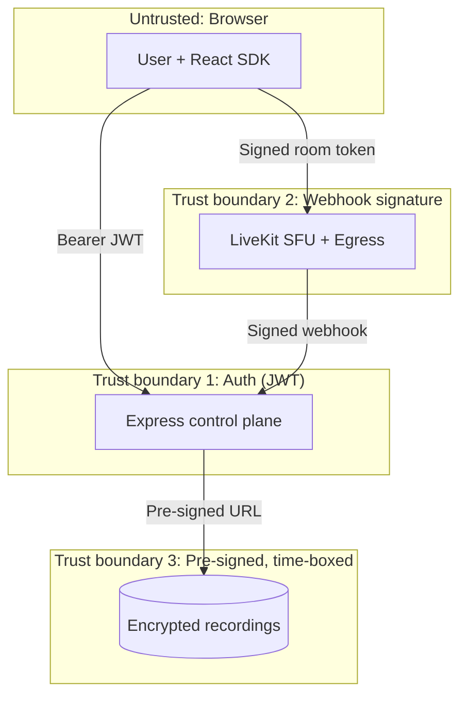

---

## 16. Observability & audit

- **Audit trail** = the `CallEvent` stream: immutable, per-session, answering "who joined, when, for how long, was it recorded, who accessed the recording". This is both a product feature (call history) and a compliance artifact.
- **Metrics:** join success rate, time-to-connect, reconnection rate, ICE/TURN failure rate, no-show rate, recording success rate, Egress queue depth, SFU CPU/bandwidth per node. Surface via Prometheus/Grafana (LiveKit exports Prometheus metrics natively).
- **Media quality telemetry:** capture LiveKit client analytics (jitter, packet loss, bitrate) into the session for post-hoc quality debugging and support.
- **Alerting:** SFU node health, Egress failures, webhook processing lag, token error-rate spikes.
- **Correlation:** a `sessionId` threads logs across control plane, media plane, and storage.

---

## 17. Testing strategy

Closes G15 — today `npm test` is a stub and there are zero tests. The full flow must be tested before handover (PRD §5).

### 17.1 Test pyramid

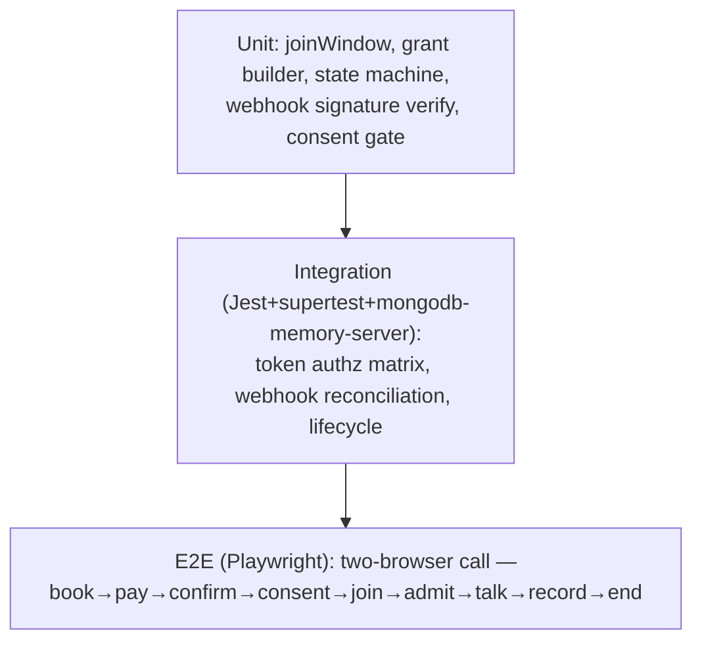

### 17.2 Coverage targets by layer

| Layer | What to test | Tooling |
|---|---|---|
| **Unit** | `joinWindow` boundaries (−15/+120), grant construction per role, state-machine transitions, idempotent webhook handling, consent gating | Jest |
| **Integration** | Token endpoint authorization **matrix** (wrong user / unconfirmed / unpaid / outside window / wrong role → correct HTTP codes); webhook → session state; recording start blocked without consent | Jest + supertest + `mongodb-memory-server`; mock `livekit-server-sdk` |
| **Contract** | Webhook signature verification against real LiveKit payloads; token decodes to expected grants | verify with `WebhookReceiver`, decode JWT |
| **E2E** | Two headless browsers complete a real call against a **local/dev LiveKit**; lobby admission; reconnect after network drop; audio-only fallback | Playwright (multi-context) |
| **Load** | N concurrent rooms, join storm, Egress under load; find the per-node ceiling | LiveKit `load-test` CLI / k6 for the token endpoint |
| **Security** | Token replay after TTL, cross-room token rejection, unpaid access attempt, unsigned webhook rejection | Jest + manual pen checklist |

### 17.3 Authorization matrix (must-pass integration cases)

| Requester | Appt state | Payment | Window | Expected |
|---|---|---|---|---|
| Participant patient | CONFIRMED | PAID | inside | 200 + patient grants |
| Participant doctor | CONFIRMED | PAID | inside | 200 + `roomAdmin` |
| Non-participant | CONFIRMED | PAID | inside | 403 |
| Participant | BOOKED | — | inside | 409 `APPT_NOT_CONFIRMED` |
| Participant | CONFIRMED | PENDING | inside | 402 `PAYMENT_REQUIRED` |
| Participant | CONFIRMED | PAID | before −15m | 403 `WINDOW_NOT_OPEN` |
| Participant | CONFIRMED | PAID | after +120m | 403 `WINDOW_CLOSED` |
| Expired token | — | — | — | LiveKit rejects at WS connect |

---

## 18. Deployment topology & cost

### 18.1 Topology

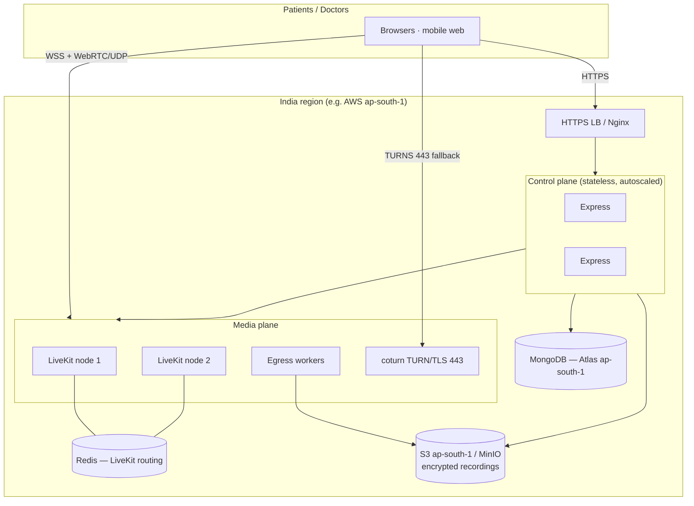

### 18.2 Deployment notes

- **Control plane** stays as the current stateless Express app → containerize, run ≥2 replicas behind the LB, autoscale on CPU/RPS. No stickiness needed.
- **LiveKit** is stateful for media. Single node handles a meaningful number of 1:1 consults (ViQure's dominant case — one patient, one doctor); add nodes + **Redis** for multi-node routing as concurrency grows. Requires open **UDP** range (or TURN/TCP 443 fallback).
- **Egress workers** are CPU/RAM-heavy (Chrome+ffmpeg) → separate node pool, scale by concurrent-recording count; can scale to zero when recording is disabled.
- **coturn** on 443/TLS for firewall traversal.
- **Storage & DB** pinned to India region for residency.
- **Config/secrets:** `LIVEKIT_API_KEY/SECRET/WS_URL`, storage creds, FCM/SMS keys via a secrets manager — never in the client.

### 18.3 Cost posture

Self-hosting trades per-minute CPaaS fees for **fixed infra + ops time**: a small SFU node, an autoscaling Egress pool (only when recording), coturn, storage, and egress bandwidth (the real variable cost — WebRTC media and recording uploads). For ViQure's 1:1 telehealth profile this is economical at low-to-moderate volume and keeps media in-country. Revisit LiveKit Cloud if ops capacity is the bottleneck — **the application code does not change**, only where the SFU runs.

---

## 19. Phased roadmap & effort estimates

Estimates are solo-engineer working days, media backend + integration only (excludes unrelated PRD items). They assume familiarity ramps during Phase 1.

### Phase 0 — Foundations & migration safety (≈2–3 days)
- Add `livekit-server-sdk`; provision a dev LiveKit (Docker) + storage; env/secrets wiring.
- Additive schema: `provider`/`roomName`/`sessionId` on `MeetingSchema`; new `ConsultationSession`, `CallEvent`, consent, recording models; register in `models/index.js`.
- Feature flag `VIDEO_PROVIDER=jitsi|livekit`; keep legacy Jitsi rooms working (`provider` discriminator).
- **Deliverable:** infra + data model in place, nothing user-visible yet.

### Phase 1 — Secure core (the make-it-safe phase) (≈5–7 days) 🔴 must-have
- Token endpoint with the full server-side authorization matrix (Section 6), incl. **payment gate** (G4) and **server-authoritative window** (G3).
- Signed webhook handler + lifecycle reconciliation → `ConsultationSession` state machine (Section 7).
- Replace `Consultation.jsx` Jitsi embed with `LiveKitRoom`; remove dead `meet.viqure.com` fallback (G16).
- App-layer **waiting room** + doctor admission (Section 8).
- Consent gate (teleconsult) before token issuance (G14, partial).
- Hardening: enforce `JWT_SECRET`, lock CORS, re-enable rate limiting, strip token logging.
- Integration tests for the authorization matrix.
- **Deliverable:** owned, tokenized, lifecycle-tracked 1:1 video call safe for real patients. **This is the minimum viable production feature.**

### Phase 2 — Clinical & resilience hardening (≈5–7 days) 🟠 high value
- **Recording** via Egress + consent gating + India-region encrypted storage + pre-signed access (G7).
- **Notifications** service (activate `fcmToken`): "doctor is ready", reminders, no-show (G9).
- **Pre-call device check** + reconnection UX + **PHONE fallback** + error taxonomy (G10, G11, G13).
- In-call **chat + document share** over data channel; surface `documentsShared[]` (G12).
- No-show detection + refund/reschedule hooks.
- E2E (Playwright two-browser) + contract tests.
- **Deliverable:** production-grade consult with recording, notifications, and graceful failure.

### Phase 3 — Scale, observability & ops (≈3–5 days) 🟡 as volume grows
- Multi-node LiveKit + Redis; coturn on 443; autoscaling policies.
- Prometheus/Grafana dashboards + alerting; media-quality telemetry.
- Load testing to establish per-node ceilings; capacity plan.
- Admin observer/dispute-review flow; retention/erasure automation (DPDP).
- **Deliverable:** operable at scale with SLOs and compliance automation.

```mermaid
gantt
  title Video consultation completion (solo, indicative)
  dateFormat  X
  axisFormat  %s
  section Phase 0
  Foundations & migration      :p0, 0, 3
  section Phase 1 (must-have)
  Secure core                  :p1, after p0, 7
  section Phase 2 (high value)
  Clinical & resilience        :p2, after p1, 7
  section Phase 3 (scale)
  Scale & observability        :p3, after p2, 5
```

**Total to a genuinely production-ready feature:** ≈ **15–22 working days** solo (Phases 0–2), with Phase 3 as volume demands.

---

## 20. Risks & open decisions

| # | Risk / decision | Recommendation |
|---|---|---|
| R1 | **Self-hosting ops burden** (SFU + Egress + TURN are non-trivial to run) | Start self-hosted single-node; keep LiveKit Cloud as a zero-code-change escape hatch if ops capacity is short |
| R2 | **Egress cost/complexity** (Chrome+ffmpeg heavy) | Recording off by default; Egress pool scales to zero; only enable per consented session |
| R3 | **UDP blocked on clinic/hospital networks** | Mandatory TURNS on 443; validate in pre-call check |
| R4 | **Data residency interpretation** under DPDP rules (still maturing) | Pin all media/storage to India region now; get privacy-counsel sign-off (Section 15 caveat) |
| R5 | **Migration of in-flight appointments** | `provider` discriminator + feature flag; legacy Jitsi rooms drain naturally, no big-bang cutover |
| R6 | **Recording retention period** (medical-record norms vs storage cost vs erasure rights) | Decide retention with medico-legal input; implement as config + lifecycle policy |
| R7 | **Payment-before-access policy** edge cases (free follow-ups, insurance) | Make the payment gate policy-driven, not hard-coded, so exceptions are configurable |
| R8 | **Admin observer in a clinical call** (privacy) | Restrict to explicit dispute review, read-only, consent-aware, and logged |

**Open questions to confirm with the team:** retention duration for recordings; whether recording is opt-in per consult or a clinic-wide policy; SMS provider choice; whether to self-host MongoDB or use Atlas (ap-south-1); and the no-show refund policy that the lifecycle should enforce.

---

## 21. Appendix: schema diffs, endpoints, env

### 21.1 Environment variables (new)

```bash
# LiveKit
LIVEKIT_WS_URL=wss://media.viqure.example   # public, sent to client
LIVEKIT_API_KEY=...                          # server-only
LIVEKIT_API_SECRET=...                        # server-only, signs tokens
LIVEKIT_WEBHOOK_KEY=...                        # verify inbound webhooks

# Recording storage (India region)
REC_S3_BUCKET=viqure-recordings
REC_S3_REGION=ap-south-1
REC_S3_ACCESS_KEY=...
REC_S3_SECRET_KEY=...
REC_S3_KMS_KEY=...

# Notifications
FCM_SERVER_KEY=...
SMS_API_KEY=...
SMTP_URL=...

# Policy
VIDEO_PROVIDER=livekit            # livekit | jitsi (migration flag)
JOIN_EARLY_MINUTES=15
JOIN_LATE_MINUTES=120
RECORDING_DEFAULT=off
```

### 21.2 Endpoint summary

| Method | Path | Auth | Phase |
|---|---|---|---|
| POST | `/api/consultations/:appointmentId/consent` | user JWT | 1 |
| POST | `/api/consultations/:appointmentId/token` | user JWT | 1 |
| GET | `/api/consultations/:appointmentId/session` | user JWT | 1 |
| POST | `/api/consultations/:sessionId/admit` | doctor | 1 |
| POST | `/api/consultations/:sessionId/end` | doctor | 1 |
| POST | `/api/webhooks/livekit` | LiveKit signature | 1 |
| POST | `/api/consultations/:sessionId/recording/start` | doctor | 2 |
| POST | `/api/consultations/:sessionId/recording/stop` | doctor | 2 |
| GET | `/api/consultations/:sessionId/events` | admin/participant | 2 |
| GET | `/api/consultations/:sessionId/recording/url` | admin/participant | 2 |

### 21.3 Files touched (implementation map)

| Action | Path |
|---|---|
| New | `server/controllers/consultation.controller.js` (token, consent, admit, end, recording, events) |
| New | `server/controllers/livekitWebhook.controller.js` |
| New | `server/routes/consultation.routes.js`, `server/routes/webhook.routes.js` |
| New | `server/models/consultationSession.model.js`, `callEvent.model.js`, `consent.model.js`, `recording.model.js` |
| New | `server/services/livekit.service.js` (RoomService/Egress/token helpers), `notification.service.js` |
| Edit | `server/models/appointments.model.js` (`MeetingSchema` additive fields) |
| Edit | `server/models/index.js` (register new models) |
| Edit | `server/controllers/appointment.controller.js` (`confirmAppointment`: create session/room via service instead of inline Jitsi) |
| Edit | `server/app.js` (mount webhook route w/ raw body before `protect`; re-enable rate limit; lock CORS) |
| Rewrite | `client/src/pages/Consultation.jsx` (LiveKitRoom) |
| New | `client/src/pages/consultation/PreCallCheck.jsx`, `ConsentGate.jsx`, `WaitingRoom.jsx`, `CallStage.jsx` |
| New | `client/src/hooks/useConsultationSession.js` |
| Edit | `client/src/pages/Appointments.jsx`, `DoctorDashboard.jsx` (single tokenized join path; remove dead fallback) |
| New | `test/` suites per Section 17 |

---

*End of blueprint. This document is designed to be committed alongside `ViQure_Technical_Assessment.md` and used as the implementation reference for the video consultation workstream.*


